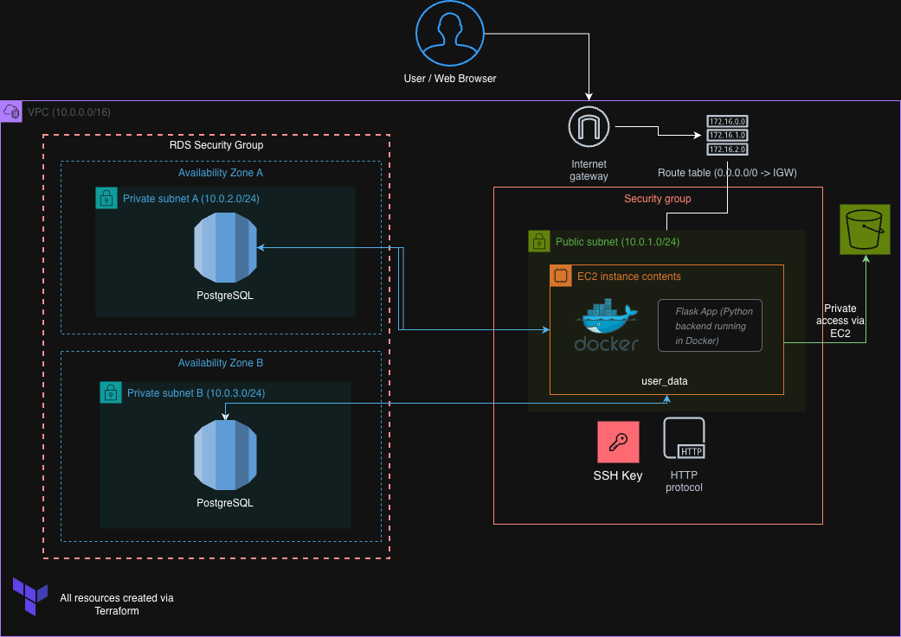

<h1 align="center">🛒 GroceryMate Cloud Deployment</h1>

  Full AWS Cloud deployment of the GroceryMate web app, using <b>Terraform</b>, <b>Docker</b>, and <b>Flask</b>. 
  Developed as part of the <b>Masterschool Cloud Engineering</b>.

---

<h2>🚀 Overview</h2>

  GroceryMate is a modern e-commerce web app designed for grocery shopping.
  Users can browse products, manage their cart, and simulate purchases.
  The backend is built with <b>Flask</b> and connected to a <b>PostgreSQL RDS</b> database.
  The app runs inside a <b>Docker container</b> on <b>AWS EC2</b>, with static files stored in <b>S3</b>.
  The full infrastructure is provisioned automatically using <b>Terraform</b>.

---

<h2>☁️ Architecture</h2>

  

<b>Workflow:</b>

<ol>
  <li>Terraform provisions VPC, subnets, EC2, RDS, and S3.</li>
  <li>EC2 runs Flask inside Docker (port 5000).</li>
  <li>Flask connects to RDS via private networking.</li>
  <li>S3 is used for static assets via IAM access.</li>
  <li>App is reachable through the EC2 public IP.</li>
</ol>

---

<h2>🧱 Project Structure</h2>

<pre>
AWS_grocery_v2/
├── backend/
│   ├── app/
│   ├── Dockerfile
│   ├── requirements.txt
│   ├── run.py
│   └── .env
├── infrastructure/
│   ├── main.tf
│   ├── ec2.tf
│   ├── rds.tf
│   ├── s3.tf
│   ├── variables.tf
│   ├── outputs.tf
│   └── terraform.tfvars
├── diagram.png
└── README.md
</pre>

---

<h2>🐳 Docker Setup</h2>

<pre><code>FROM python:3.9-slim

WORKDIR /app

COPY requirements.txt .
RUN pip install --no-cache-dir -r requirements.txt

COPY . .

EXPOSE 5000
CMD ["python", "run.py"]
</code></pre>

<b>Explanation:</b>

<ul>
  <li>Starts from a clean Python 3.9 image.</li>
  <li>Copies project files into the container.</li>
  <li>Installs dependencies from <code>requirements.txt</code>.</li>
  <li>Runs Flask on port 5000.</li>
</ul>

---

<h2>⚙️ Running on EC2</h2>

<pre><code>cd ~/AWS_grocery_v2/backend
sudo docker build -t grocerymate .
sudo docker run -d -p 5000:5000 --env-file .env grocerymate
</code></pre>

Check container status:

<pre><code>sudo docker ps
</code></pre>

Then open in your browser:

<pre><code>http://&lt;EC2_PUBLIC_IP&gt;:5000
</code></pre>

---

<h2>🧩 Deployment Steps</h2>

<ol>
  <li><b>Configure variables:</b> Edit <code>terraform.tfvars</code> with your region, key pair, and passwords.</li>
  <li><b>Deploy:</b>
    <pre><code>terraform init
terraform apply -auto-approve</code></pre>
  </li>
  <li><b>Connect to EC2:</b>
    <pre><code>ssh -i "grocerymate-key.pem" ec2-user@&lt;EC2_PUBLIC_IP&gt;</code></pre>
  </li>
  <li><b>Run the app:</b>
    <pre><code>cd ~/AWS_grocery_v2/backend
sudo docker build -t grocerymate .
sudo docker run -d -p 5000:5000 --env-file .env grocerymate</code></pre>
  </li>
</ol>

---

<h2>🗂️ Environment Variables</h2>

<pre><code>DB_HOST=grocerymate-db.xxxxxx.eu-north-1.rds.amazonaws.com
DB_NAME=grocerymate_db
DB_USER=grocery_user
DB_PASSWORD=StrongPassword123
</code></pre>

---

<h2>🧹 Clean Up</h2>

To avoid AWS costs, destroy the infrastructure:

<pre><code>terraform destroy -auto-approve
</code></pre>

---

<h2>📸 What’s Working</h2>

<ul>
  <li>✅ Terraform provisions EC2, RDS, S3, and networking</li>
  <li>✅ Docker builds and runs successfully</li>
  <li>✅ Flask connects to RDS via environment variables</li>
  <li>✅ App accessible via EC2 public IP</li>
  <li>✅ Infrastructure fully reproducible</li>
</ul>

---

<h2>📘 About This Project</h2>

  This project was developed as part of the <b>Masterschool Cloud Engineering (June 2025 Cohort)</b>.
  The goal was to deploy a real-world Flask application on AWS using <b>Terraform</b> and <b>Docker</b>,
  demonstrating automation, Infrastructure as Code, and secure architecture design.

---

<h2>👨‍💻 Authors & Contributions</h2>

  <b>Original Application:</b> Alejandro Román Ibáñez 
  <i>Base Flask application and initial project design</i>  

  <b>Infrastructure & Deployment:</b> Misael Tóxcatl 
  <i>Implemented full Infrastructure as Code using Terraform and Docker deployment on AWS (EC2, RDS, S3)</i>  

  Masterschool Cloud Engineering Cohort – June 2025

