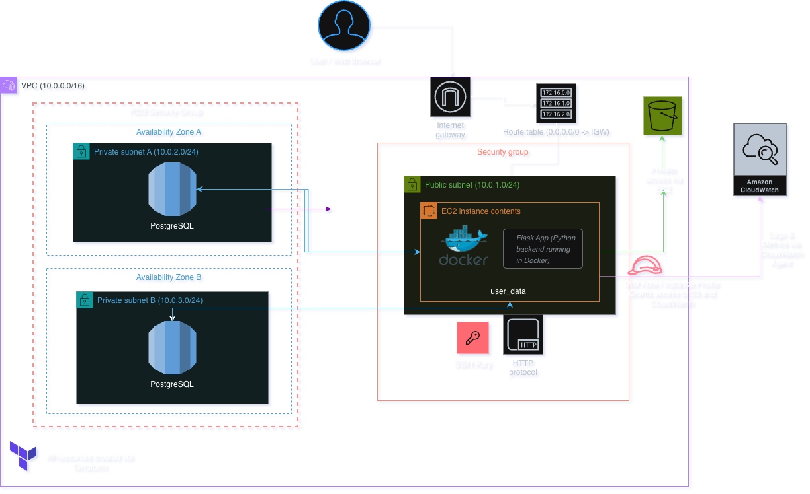

# 🛒 GroceryMate — AWS Infrastructure Deployment


**Final project for the Masterschools Cloud Engineering Program**

Production-grade AWS deployment of a grocery e-commerce platform — Flask on EC2, RDS PostgreSQL, S3, CloudWatch, and fully automated CI/CD via GitHub Actions.

> **Deployment Status:** Offline — destroyed via `terraform destroy` to avoid charges. All IaC configs in `/infrastructure`.

---

## 🏗️ Architecture



| Component | Technology |
|-----------|-----------|
| Compute | AWS EC2 (Amazon Linux 2) |
| Database | Amazon RDS PostgreSQL |
| Storage | Amazon S3 (static assets) |
| Logging | Amazon CloudWatch Agent |
| Security | IAM Roles + Security Groups |
| IaC | Terraform (modular) |
| CI/CD | GitHub Actions |

---

## 🔄 CI/CD Pipeline
```
Push to version2
      ↓
✅ Terraform CI (parallel)    ✅ Docker Build Check (parallel)
   → terraform fmt               → docker build
   → terraform validate          → verifies image builds
      ↓                               ↓
      └──────────── both pass ────────┘
                      ↓
           ⏸️ Manual approval gate
                      ↓
            🚀 terraform apply → provisions all AWS resources
```

AWS credentials stored as **GitHub Secrets** — never hardcoded.

---

## ⚙️ Terraform Modular Structure
```
infrastructure/
├── main.tf          ← orchestrates all modules
├── provider.tf
├── variables.tf
└── user_data.tpl    ← EC2 bootstrap script

modules/
├── network/         ← VPC, subnets, IGW, route tables
├── compute/         ← EC2, instance profile, security group
├── database/        ← RDS PostgreSQL, subnet group
├── storage/         ← S3 bucket
├── iam/             ← roles for EC2 → S3 and EC2 → CloudWatch
└── cloudwatch/      ← log group configuration
```

---

## 🧩 EC2 Automated Bootstrap

On launch, `user_data.tpl` automatically:

1. Installs Docker, Git, and PostgreSQL client
2. Clones this repository
3. Builds the Flask Docker image
4. Starts the container linked to RDS via environment variables
5. Installs and configures the CloudWatch Agent for log streaming

Zero manual SSH configuration needed.

---

## 🚀 Deployment
```bash
cd infrastructure
terraform init
terraform plan
terraform apply
```

Terraform outputs the EC2 public IP and RDS endpoint on completion.

---

## 📊 Monitoring

Logs stream automatically to CloudWatch under `/aws/flask/grocerymate`. View on EC2 directly:
```bash
sudo tail -f /var/log/grocerymate.log
```

---

## 🧹 Cleanup
```bash
terraform destroy
```

---

## 📝 Lessons Learned

- **CI/CD with GitHub Actions** — parallel Terraform validation + Docker build check with manual approval gate
- **Modular Terraform** — organized 6 reusable modules (network, compute, database, storage, IAM, CloudWatch) keeping infrastructure maintainable and scalable
- **RDS integration** — injected database credentials via Terraform environment variables, avoiding hardcoded secrets
- **CloudWatch observability** — configured CloudWatch Agent via user_data to stream application and system logs automatically on EC2 launch

---

## 🧾 Credits

**Original Application:** [Alejandro Román Ibáñez](https://github.com/AlejandroRomanIbanez)
**AWS Infrastructure & CI/CD:** [MisaelTox](https://github.com/MisaelTox)